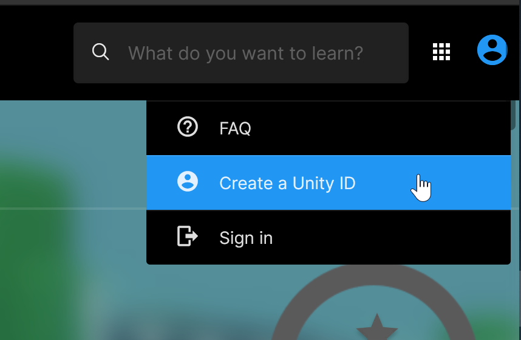
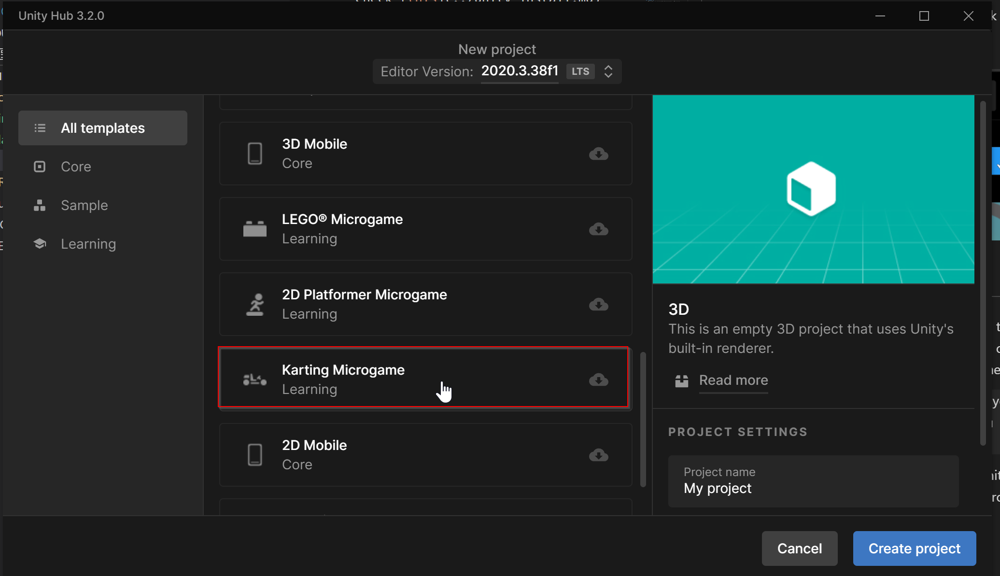

# Lab 1
> This lab is NOT graded.

## Prerequisites
* Unity is installed and set up. Check [this](../unity_install.md) guide to install it.
* Create a Unity ID, if you don't already have one:

# Task 1
- Create your first microgame using the `New Project` button on the Unity Hub or by going on this [page](https://learn.unity.com/project/karting-template) and starting the project.

> Important: after creating the project, make sure you select that you're a first-time user of unity and that you would like to do the tutorial

- Follow the tutorial provided by Unity.
- Once you reach the step to build and publish the game, you're done with the tutorial and you can exit the project.

# Task 2
- Re-open the same project, but this time choose that you're familiar with unity, so you can play around with the microgame configuration.
- Change the color and speed of your car.
- Add multiple jumping sliders, practice rotating, sclaing and re-positioning the object until you get it on the right level on the road.
- Add condition to not let the car fall out of the track after jumping (maybe some kind of an invisible wall?)

# Task 3
- Create a second microgame of your choice from the ones provided by unity.
- Skip the tutorial, and get creative.

# Submission
No submission is required for this lab.
