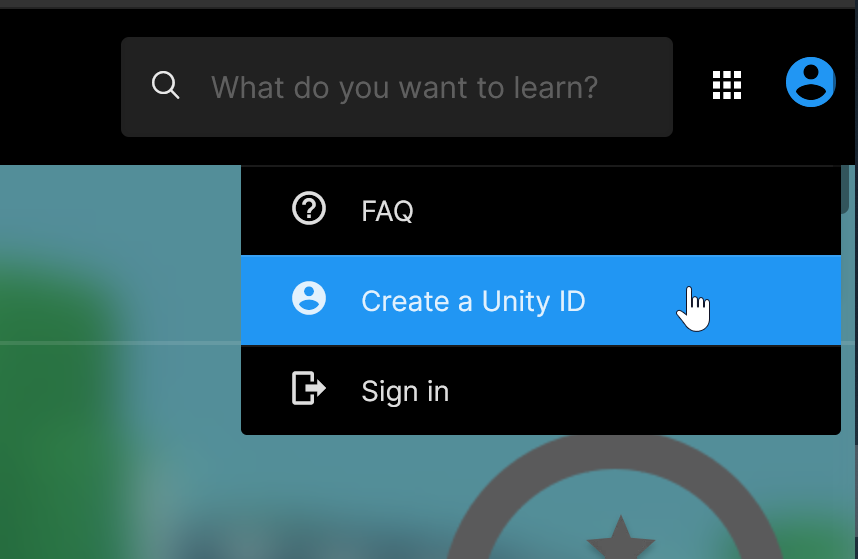
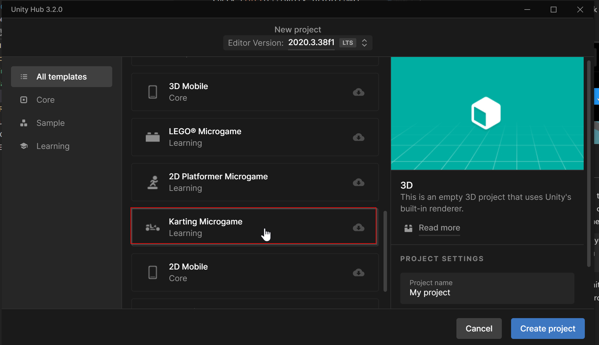

# Lab 1

> Although this lab is **not** graded, I encourage you to submit your final work by the end of the lab time even if it's a work in progress. I will be looking at the results and I will provide feedback. Please consult the [submission](#submission) section.

## Prerequisites
* Unity is installed and set up. Check [this](../unity_install.md) guide to install it.
* Create a Unity ID, if you don't already have one:

# Task 1
- Create your first microgame using the `New Project` button on the Unity Hub or by going on this [page](https://learn.unity.com/project/karting-template) and starting the project.

> Important: after creating the project, make sure you select that you're a first-time user of unity and that you would like to do the tutorial

- Follow the tutorial provided by Unity.
- Once done with the tutorial, the project will exit.

# Task 2
- Re-open the same project, but this time choose that you're familiar with unity, so you can play around with the microgame configuration.
- Change the color and speed of your car.
- Add multiple jumping sliders, practice rotating, sclaing and re-positioning the object until you get it on the right level on the road.
- Add condition to not let the car fall out of the track after jumping (maybe some kind of an invisible wall? <- impress me with your ideas)

# Task 3
- Create a second microgame of your choice from the ones provided by unity.
- Skip the tutorial, and get creative.

# Submission
Please submit the outputs of Task 2 and Task 3 either on Omnivox as a single `.zip` file with your name and id, or upload it on Github in your own repo for labs in general and share the link with me on Omnivox.
