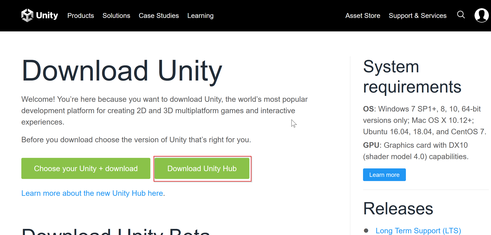
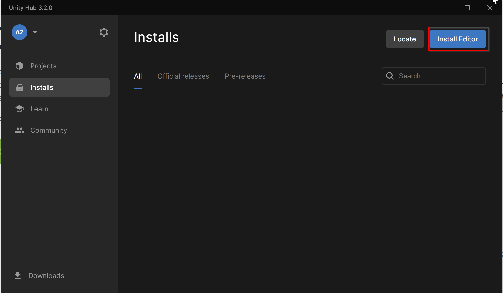
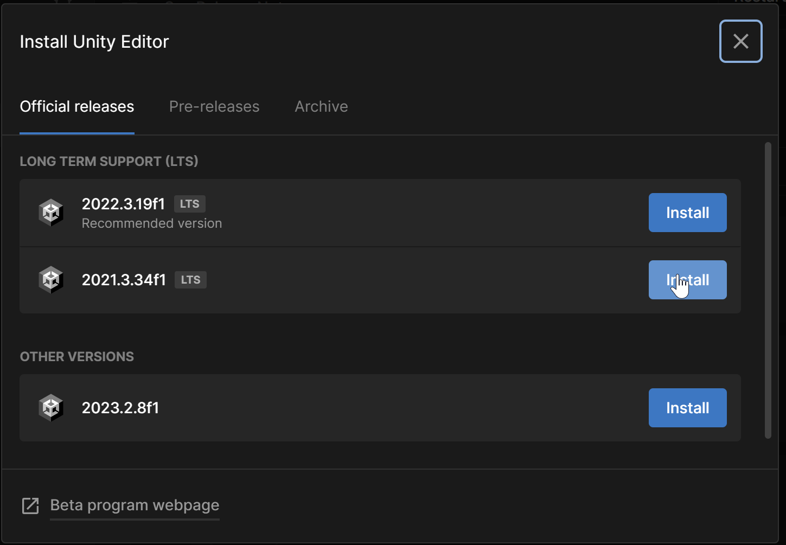
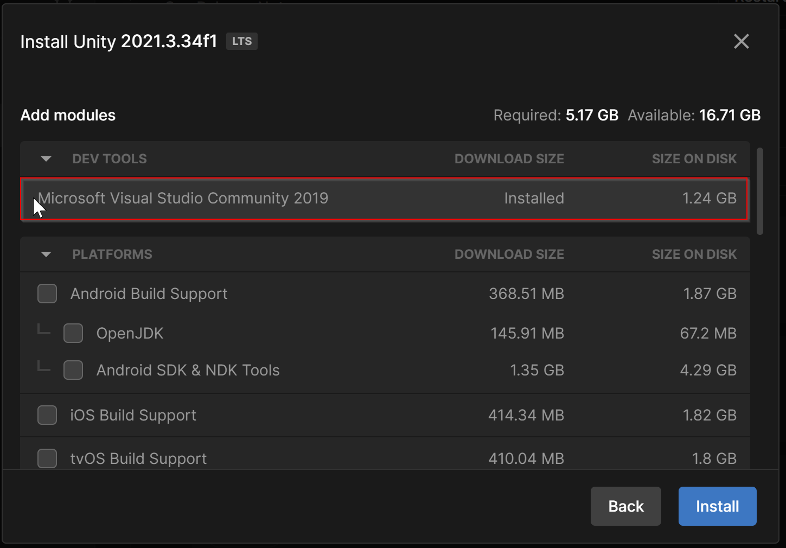
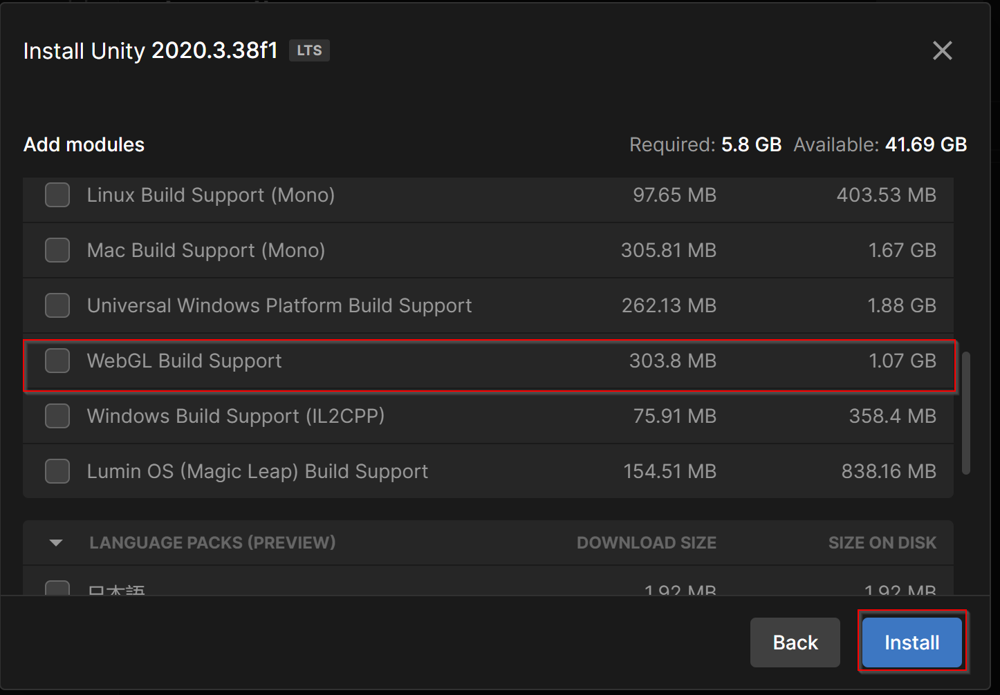

# Setup Unity
This guide will explain exactly how to install Unity and set it up with Visual Studio.

## Steps
1. Download and install Unity Hub from [here](https://unity3d.com/get-unity/download)

1. Follow the installation instructions and when done, open Unity Hub
1. Install the correct editor version (**2021.3.34f**) from the hub as shown below:

1. Make sure you select Visual Studio and WebGL Support as part of the installation as follows:

1. Click on install and wait for the installation to finish. (this may take 10-20 minutes)

> You may use VS Code instead of Visual Studio Community. VS Code provides a bunch of extensions to support C# and Unity libraries with autocompletion as well.